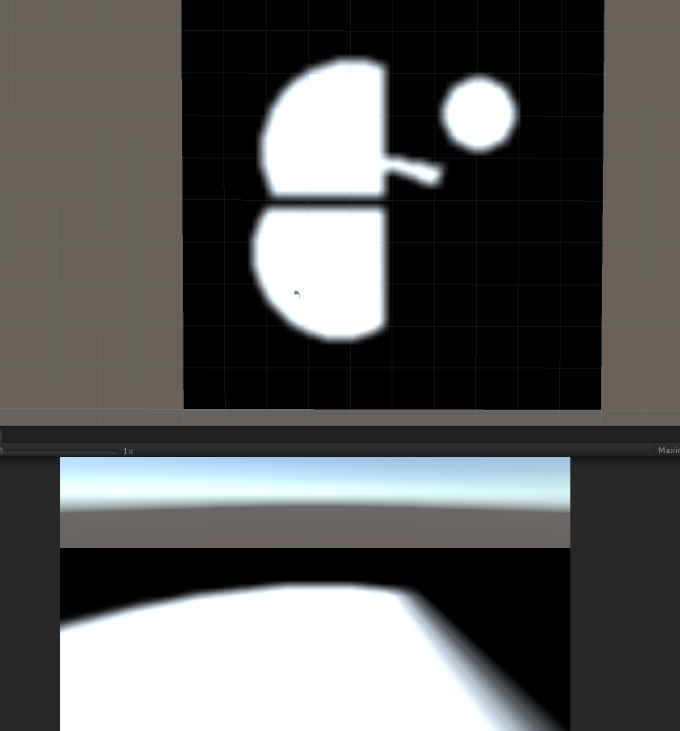

# Introduction
1. the pulgin can create fog effect in games. It’s used for 2.5D RGP games, like Dota and LOL. 
2. It’s especially suitable for mobile games because of the pulgin is based on mesh render, not post-process. 
3. The cacualtion of fog is on cpu, algorithm is based on Greg McIntyre's libfov:https://sourceforge.net/projects/libfov/。

# 简介
1. 用Unity实现的战争迷雾，能创建2.5D RPG 游戏，如Dota,LOL。 
2. 实现方式是基于网格计算迷雾，没有使用后处理的方式，适用于移动和PC端。 
3. 迷雾的计算在CPU端，该算法基于Greg McIntyre的libfov:https://sourceforge.net/projects/libfov/。

# Screenshot

